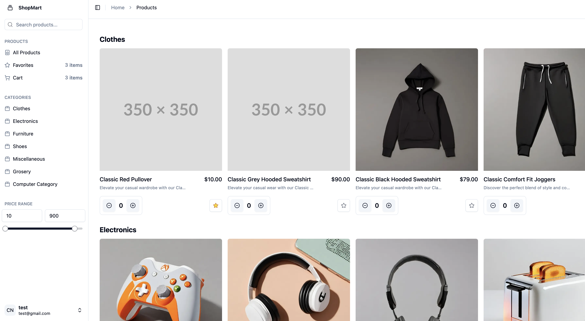

# ShopMart

This project is created as a requirement for passing Module 4, which is part of the Second Milestone in the RevoU Fullstack Engineering Course. I'm Riki from the 4th team in the Paris section.

## Project Goals
- [x] Create a user-friendly online shopping experience using core React functionalities.
- [x] Implement user authentication, product management, and effective routing.
- [x] Utilize APIs to fetch and display data within the application.
- [ ] Implement robust testing methodologies to ensure application reliability.
- [x] Enhance the application using Next.js features and advanced routing techniques.
- [ ] Manage data effectively, including authentication and integration of middleware.

## Installation
This project is powered by [Next.js](https://nextjs.org/), and all the scripts required to get up and running are available in the `package.json` file.

To install dependencies:
```shell
npm install
```

To run the project in development mode:
```shell
npm run dev
```

To build production code:
```shell
npm run build
```

## Overview
This is the source code for ShopMart, an online shop built on top of the [Platzi Fake Store API](https://fakeapi.platzi.com/). The project is built using [Next.js](https://nextjs.org/), with the following technologies:
- Server Actions, Server Components, and Client Components
- Authentication and registration powered by [Platzi Fake Store API](https://fakeapi.platzi.com/)
- Custom hooks
- React contexts
- Lazy-loaded images with fallback
- Data cleanup and validation

## Features
- A landing page showcasing top products and available categories
- A product detail page
- A product list page with filters
- Login and Register pages

## Preview
The website is under active maintenance, expect changes in near future!



## Live Website
The website is deployed on [Vercel](https://vercel.com/), and the live version is available at [here.](https://shopmart-jamd.vercel.app/)
